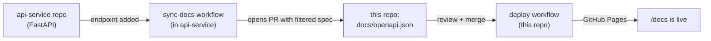

# PioSphere

The PioSphere frontend (Vite + React 19 + TanStack Router + Tailwind v4).
The API reference at `/docs` is rendered by
[@scalar/api-reference-react](https://github.com/scalar/scalar) from
`docs/openapi.json` — and that file is never edited by hand.

## The docs pipeline (two repositories)

The API contract lives in a separate repository,
[api-service](https://github.com/Sanskargupta0/api-service) (FastAPI).
When the API changes there, GitHub Actions regenerates the customer-facing
spec and opens a pull request **here** updating `docs/openapi.json`.
Merging that PR triggers this repo's deploy workflow and the change goes
live at `/docs`.



## Repository layout

| Path | Purpose |
| --- | --- |
| `src/` | Frontend app (routes, features, i18n, styles) |
| `docs/openapi.json` | Generated customer spec (do not edit; updated by PRs from api-service) |
| `.github/workflows/deploy.yml` | Build → GitHub Pages |

## Run locally

Node 22+, pnpm:

```bash
pnpm install
pnpm dev        # http://localhost:3000
```

See [api-service](https://github.com/Sanskargupta0/api-service) for the
API source of truth and how customer-facing vs internal endpoints are
selected.
