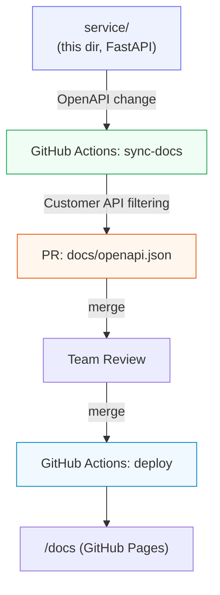

# PioAgent Service

FastAPI implementation of the PioAgent customer API. This directory is the
**source of truth for the API contract**: when the API changes, GitHub
Actions regenerates the customer-facing OpenAPI specification and opens a
pull request in this repository updating `docs/openapi.json`, where the
team reviews it before it is published at `/docs`.

## Architecture



## What's in this repository

| Path | Purpose |
| --- | --- |
| `app/main.py` | FastAPI app: customer endpoints (`/api/v1/*`) and internal endpoints (`/internal/*`) |
| `app/schemas.py` | Pydantic models (User, Task) |
| `scripts/export_openapi.py` | **Customer API selection** — filters the full OpenAPI spec down to customer-facing endpoints |
| `../.github/workflows/sync-docs.yml` | Syncs the filtered spec into `docs/openapi.json` as a pull request |

### Customer-facing vs internal endpoints

The service exposes five endpoints; only three are published:

```
Service OpenAPI
├── GET /api/v1/users          → Customer API ✓
├── GET /api/v1/users/{id}     → Customer API ✓
├── GET /api/v1/tasks          → Customer API ✓
├── GET /internal/health       → Internal ✗ (hidden)
└── GET /internal/admin/users  → Internal ✗ (hidden)
```

The allow-list lives in `CUSTOMER_API_PATHS` in
`scripts/export_openapi.py`. To publish a new endpoint, add its path there —
the next sync picks it up. To keep one internal, simply don't list it.

## Run locally

Requires Python 3.10+.

```bash
python -m venv .venv
source .venv/bin/activate        # Windows: .venv\Scripts\activate
pip install -r requirements.txt
uvicorn app.main:app --reload
```

- API: http://localhost:8000/api/v1/users
- Full OpenAPI (includes internal endpoints): http://localhost:8000/openapi.json

## Export the customer-facing OpenAPI spec

```bash
python scripts/export_openapi.py
```

Writes `openapi/customer-openapi.json` and prints which endpoints were
published and which were filtered out. This is exactly what the GitHub
Actions workflow runs.

## How the GitHub Actions synchronization works

`.github/workflows/sync-docs.yml` (at the repository root) runs on every push
to `main` that touches the app or the export script:

1. Checks out this repository.
2. Generates the customer-facing OpenAPI spec (`scripts/export_openapi.py`).
3. Compares the new spec with `docs/openapi.json` — if identical, stops.
4. Otherwise opens/updates a pull request in this repository
   (branch `sync/customer-openapi`) via
   [peter-evans/create-pull-request](https://github.com/peter-evans/create-pull-request).
5. The team reviews and merges the PR; the deploy workflow builds the site
   and publishes it to GitHub Pages; `/docs` shows the updated API.

Because service and frontend live in one repository, the default
`GITHUB_TOKEN` is enough — no PAT or extra secrets to configure.

## Testing the complete workflow

1. Make an API change, e.g. in `app/main.py`:

   ```diff
   -    summary="Get all users",
   +    summary="Get all active users",
   ```

   …or add a new endpoint and add its path to `CUSTOMER_API_PATHS` in
   `scripts/export_openapi.py`.

2. Commit and push to `main`.
3. Watch the **Sync customer API docs** workflow run in the Actions tab.
4. A pull request appears updating `docs/openapi.json`.
5. Review the diff and merge.
6. The deploy workflow publishes the site to GitHub Pages.
7. Open `/docs` — the Users API now reads "Get all active users".

You can also trigger the workflow manually from the Actions tab
(**Run workflow**).

## Deploying the service

The service can run anywhere Python runs (Render, Railway, Fly.io, a VM…).
For the demo it does not need to be deployed at all — the documentation
sync works purely from the repository contents.
